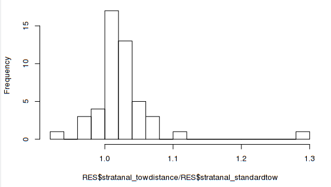
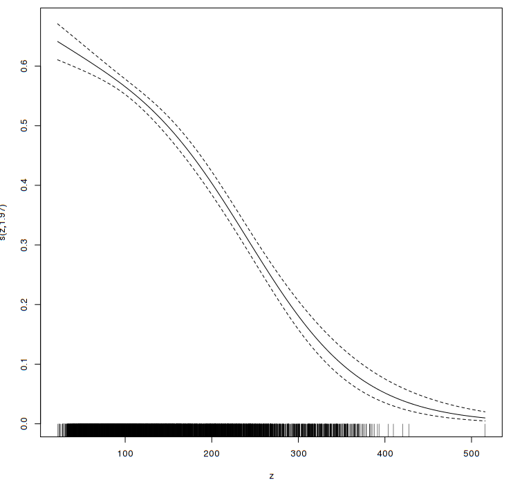
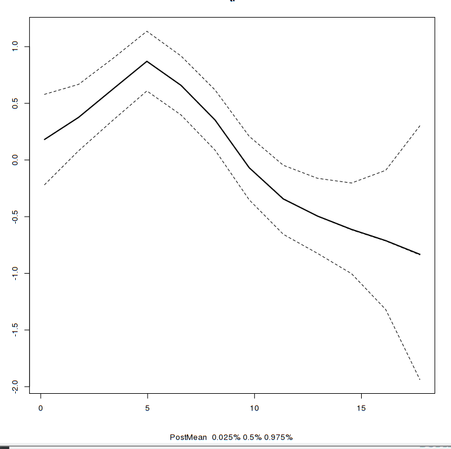

Comparing CARSTM to Stranal results:

NOTE:: remove GLM methods that do not make sense

Challenger Drive, Dartmouth, Nova Scotia, Canada

Version: 20/12/2018

# Introduction

Ecological and biological processes demonstrate variability in space and
in time. Characterizing this variability is necessary to understand the
potential generative processes. However, information is usually observed
in designated areal units due to a number of factors: arbitrary
administrative requirements; historical precedents; and sampling design
considerations due to the need to balance information obtained vs the
practicalities of the costs of time and resources required for sampling.
Strategies can range from completely random sampling in the absence of
additional information, to some form of stratified random design. In the
latter, samples are chosen randomly from strata that are characterised
*a priori* by informative factor(s). Analysis of covariance (ANOVA) is a
common application of such stratification, numerically blocking
variability of informative factor(s) that cannot be directly measured.
In the marine context, factors such as depth, substrate type,
temperature or some important oceanic features, are commonly used to
define such strata, such that the variability within strata of such
important factors will be smaller than that between strata. The lower
the variability within strata (relative to between-strata variability),
the more successfully stratification has controlled for these nuisance
effects. The suggestion is that a sample within a stratum is
representative of the stratum.

Figure 1.1. The area of interest in the Atlantic Maritimes Region of
eastern Canada. Shown are the areal units (black lines) used for survey
sampling for the purposes of stock abundance assessment. This area is at
the confluence of the Gulf Stream from the south, Labrador Current and
St. Lawrence outflow from the north. It is hydro-dynamically very
complex. Overlaid are isobaths (light blue) that show that many of the
areal units often follow bathymetric contours.

The problem of course is that samples are not representative of the area
that they are supposed to represent. This is because the processes of
interest in ecological systems generally are controlled by large number
of informative and interacting factors that are themselves complex
interacting. The end result is that their influence is not manifest
always the same manner in a given location. Ocean currents and water
masses move, environmental and ecosystem state changes with invasive
species, the collapse or proliferation of predators, and disease
outbreaks, all of which have some spatial and spatiotemporal pattern.

As the number of relevant factors increase, the number of strata
required to adequately block out such factors statistically in the sense
of classical ANOVA increases to non-viable levels in terms of required
time and resources. This increase is exponential as more than one sample
is required in each block and in the case of two spatial dimensions, the
number of units increases by a factor of two relative to any linear
reduction of scale. When, the informative features are dynamic, their
relevance in static strata can cause a mismatch with the presumed
factors of importance. That is, there can be spatial and or temporal
aliasing in that a sample is taken at a very different temperature (for
example) or time of year than the overall average temperature of the
strata that it is supposed to represent. Furthermore, this blocking or
factorial approach, only crudely adjusts for the influence of these
extraneous factors by factoring them out and otherwise ignoring them as
nuisance factors. In reality, these factors are, by definition, actually
very informative and can facilitate understanding the focal process(es)
of interest. Ignoring them or at least trying to ignore can be
detrimental, as will be shown below.

There exist two main approaches towards incorporating such additional
information: (1) spatially continuous process and (2) spatially
aggregated areal units. Both approaches decompose the spatial patterns
into those that are associated with: informative factors; structured
spatial autocorrelation patterns; and completely spatially unstructured
errors. That is, to be explicit, the treatment of the units of study
(e.g., strata) are no longer treated as a fixed factor but rather as
being derived from some constrained, random process. In another
document, we develop methods to treat the continuous case, especially
when the focal traits of interest are not spatially stationary
(**stmv**, an R-package found at https://github.com/jae0/stmv).

In the following, we will summarize the general background to the field,
following closely Banerjee et al.' s (2004) exceptionally clear and
thorough exposition of these ideas as they relate to this second class
of spatially aggregated areal units. We then describe **carstm**, an
R-package (https://github.com/jae0/carstm) developed to leverage the
speed and flexibility of **INLA** (http://www.r-inla.org/) in computing
CAR models. It also leverages the data warehousing interfaces of the
continuous biological and environmental data layers provided by
**aegis** (https://github.com/jae0/aegis) and parenthetically, created
by **stmv**.

# Aggregated areal unit models

Background for Linear models, Generalized linear models (GLM) and
Generalized additive models (GAM) are not provided as they are quite
commonly used and well understood. The CAR model is a simple extension
of GLMs with a recently proposed parametrization (implemented by INLA as
a bym2 model) which we describe in the following.

## Conditional Autoregressive (CAR) Models 

Let the study region $S={S_{1},...,S_{K}}$ be a set of $k=1,...,K$
non-overlapping areal units (**AU**s). Observations
$\boldsymbol{Y}=(y_{1},...,y_{K})$ on such a set $S$, generally
demonstrate spatial and temporal autocorrelation and can be modeled as a
Generalized linear model:

$$Y|u\sim f(y|\mu,\nu^{2})$$

$$g(\mu)=\boldsymbol{x}^{T}\boldsymbol{\beta}+\boldsymbol{O}+\boldsymbol{\psi},$$

with offsets $\boldsymbol{O=}(o_{1},...,o_{K}\boldsymbol{)}$, if any; a
$K\times V$ matrix of covariates
$\boldsymbol{x=}(x_{kv})\in\Re^{K\times V}$; the $V$ covariate
parameters $\boldsymbol{\boldsymbol{\beta}}$ with a multivariate normal
prior with mean $\mu_{\beta}$ and diagonal variance matrix
$\Sigma_{\beta}$; and $\boldsymbol{\psi}=(\psi_{1},...,\psi_{K})$
residual error structure. The $f(\cdot)$ indicates an exponential family
(Binomial, Normal, Poisson) and $\text{E}(Y)=\mu$ with an invertable
link function $g(\cdot)=$$f^{-1}(\cdot)$. In the binomial case,
$Y\sim\text{Binomial}(\eta,\theta)$ and
$\text{ln}(\theta/(1-\theta))=\boldsymbol{x}^{T}\boldsymbol{\beta}+\boldsymbol{O}+\boldsymbol{\psi}$,
where $\eta$ is the vector of number of trials and $\theta$ the vector
of probabilities of success in each trial. In the Normal case,
$Y\sim\text{Normal}(\mu,\nu^{2})$ and
$\mu=\boldsymbol{x}^{T}\boldsymbol{\beta}+\boldsymbol{O}+\boldsymbol{\psi}$.
In the Poisson case, $Y|\mu\sim\text{Poisson}(\mu)$ and
$\text{ln}(\mu)=\boldsymbol{x}^{T}\boldsymbol{\beta}+\boldsymbol{O}+\boldsymbol{\psi}$.

The above is basic statistics and more information can be found in any
textbook. However, it is worthwhile emphasizing that in this family of
models, there is a strong assumption that residuals are independent and
identically distributed, that is: *$\boldsymbol{\psi}\sim$ iid*. If any
autocorrelation exists, such as when there is spatial or temporal, or
spatio-temporal autocorrelation, then model parameter estimation becomes
biased and uncertain if these correlations are unaccounted. The
CAR-structured approach decomposes the residual error structure
$\boldsymbol{\psi}$ into two additive random components rather than as a
fixed factorial component. These components are a spatial,
CAR-structured error **$\phi$** and a non-spatial (unstructured) *iid*
error **$\varepsilon$**:

$$\psi=\phi+\varepsilon.$$

The connectivity between AUs enters into the estimation of $\phi$ and is
by convention, represented by the elements $w_{ij}$ of an adjacency
matrix $W_{K\times K}$ such that, connectivity is designated by
$w_{ij}=1$, non-connectivity is designated by $w_{ij}=0$, and
self-connectivity, i.e., $\text{diag}(W)$, is designated as $w_{ii}=0$.
The residual spatial autocorrelation error $\phi$, is treated as a
random variable that is assumed to have a **local conditional**
distribution between neighbouring lattices
$\{p(\phi_{i}|\phi_{j},j\neq i)\}$ which approximates the **global
joint** distribution $p(\phi_{1},\phi_{2},\dots,\phi_{K})$, on the
strength of the Hammersly-Clifford Theorem (Besag 1974, Besag et al.
1991, Leroux et al. 2000, Stern and Cressie 1999). The **local
conditional** distribution (Banerjee et al. 2004) can be expressed as a
weighted sum of the random quantity, where the weights are derived from
the local neighbourhood connectivity in the adjacency matrix:

$$p(\phi_{i}|\phi_{j},j\neq i,\tau_{i})=N(\alpha\sum_{i\sim j}^{K}w_{ij}\phi_{j},\tau_{i}^{-1}).$$

Here, $\tau_{i}$ is a spatially varying precision parameter; and
$\alpha\in[0,1]$ controls the strength of spatial dependence/association
such that when $\alpha=0$ there is no spatial structure and $\alpha=1$
indicates a fully intrinsic (conditional) autoregressive model, I(C)AR.
The above assumes a single global spatial autocorrelation can be used to
approximate the spatial structure of the area of interest. This
assumption is unrealistic in many systems as covariates may not properly
exist, are unknown, or be able to express these differences between
subareas, especially when real discontinuities exist (but see **stmv**).

Under the assumption that $\phi$ is a Markov Random Field, the **joint
distribution** of the random variable is, via Brook's Lemma:

$$\phi\sim N(\boldsymbol{0},[\tau D(I-\alpha B)]^{-1}),$$

where, $D$ is a diagonal matrix of the same shape as $W$ with
$\text{diag}(D)=d_{ii}=\text{no. of neighbours for each AU}_{i}$; and
also a scaled adjacency matrix $B=D^{-1}W$, the relative
strength/influence of the connectivity for each neighbour, where
$\text{diag}(B)=b_{ii}=0$. This simplifies to:

$$\phi\sim N(\boldsymbol{0},[\tau(D-\alpha W)]^{-1}).$$

Further, the spatial dependence parameter is usually assumed to be
$\alpha=1$, which simplifies the prior further to:

$$\phi\sim N(\boldsymbol{0},[\tau(D-W)]^{-1}).$$

This covariance matrix becomes singular as the $\phi$ are
non-identifiable (adding a constant to $\phi$ leaves the joint
distribution unchanged) and thus is an improper prior. Additional
constraints are required to make it computationally tractable. By
convention, this constraint is that they sum to zero
($\sum_{k}\phi_{k}=0$). This model is a well known and frequently
utilized simplification of the CAR model, and is known as an I(C)AR
(Intrinsic conditional autoregressive) model. When applied to a Poisson
process, it is also known in the epidemiological literature as a
convolution model or a Besag-York-Mollie (BYM) model.

Setting sensible priors on the precision of the structured and
unstructured random effects has been found to be challenging as they are
dependent upon the connectivity of the area of interest. Simpson et al.
(2017) and Riebler et al. (2016), following Leroux (1999), approach this
issue by a clever parametrization the problem to what they call the bym2
model in INLA:

$$\psi=\psi(\sqrt{1-\rho}\varepsilon^{*}+\sqrt{\rho}\phi^{*})$$

where $\psi$ is the overall (extra-Poisson) standard deviation;
$\rho\in[0,1]$ models the relative balance of spatial and nonspatial
heterogeneity; $\varepsilon^{*}\sim N(0,I)$ is the unstructured random
error with fixed standard deviation of 1; and the ICAR random variable
scaled so that $\text{{Var}}(\phi^{*}=\phi/v)\approx1$. These
assumptions ensure that $\text{{Var}}(\varepsilon)\approx$
$\text{{Var}}(\phi)\approx1$ which in turn ensures that $\psi$ can be
interpreted as an overall standard deviation. The priors can then be
more conventionally understood and assigned as some prior of the
standard deviation such as a half-normal or a half-t or exponential
distribution and a $\text{Beta}(0.5,0.5)$ for $\rho$. INLA's bym2 model
by default uses the type 2 Gumbel distribution for $\rho$ (Simpson et
al. 2017).

## Spatiotemporal CAR

Time variation of the focal process of interest can also be treated as
an autoregressive process. The argument, similar to the spatial case, is
that there is a continuity in time for many processes and so an inherent
temporal autocorrelation. If covariates exist and they exhibit this
temporal autocorrelation, then temporal autocorrelation enters
mechanistically into the model. Any unaccounted or induced
autocorrelation must, however, be explicitly accounted to ensure that
*$\boldsymbol{\psi}\sim$ iid*. In the timeseries literature, these are
are known as the AR(I)MA type models (AutoRegressive Integrated Moving
Average), often used when deterministic models do not exist or difficult
to parameterize.

In a fisheries stock-assessment context, the stock assessment model is
usually a constrained timeseries model, constrained by assumptions of
biological rate processes such as mortality and growth. Current practice
is to aggregate of all areal units and treat it as a single integral
timeseries process. This is, of course, a stop-gap solution used to
avoid the difficulties of model complexity and historical limitations of
computational capacity. When all/most areal units act in an homogeneous
manner, this approximation may be sufficient to express the focal
process of interest. However, this is not always the case, especially in
the oceanographic context as temporal and spatial variability is
occurring at all scales.

Embedding such constrained temporal models into a CAR context is a
viable way forward as the assumption is that each areal unit is indeed
homogeneous (the correctness of this assumption of course is not always
as clear nor verified). The variety of ways in which this can be done is
expressed in the **stmv** document
(https://github.com/jae0/stmv/blob/master/docs/stmvMethods.pdf). The
mechanism would require model building using tools such as STAN or BUGS
that permit more complex models than INLA currently permits. The primary
limitation is computational load, which also depends upon the complexity
of the constrained timeseries model; however, with advances in cloud
computing this is becoming increasingly a viable option.

At present, in keeping with the focus upon autoregressive processes in
CAR models and using computationally viable solutions, we extend the CAR
model by the simple addition of a temporal AR(1) process. This amounts
to what are currently known as space-time separable models, separable in
that the spatial random error processes and temporal random processes
are independent (See discussion in
https://github.com/jae0/stmv/blob/master/docs/stmvMethods.pdf).

# Application: Atlantic cod in Maritimes Region of Atlantic Canada (NAFO Div. 4VWX)

Here we present, a functional way forward in abundance index estimation
that respects the spatial structure of biological data. For this example
we focus upon the spatial and temporal variability of Atlantic cod
(*Gadus morhua*) in the Maritimes Region of Atlantic Canada (NAFO Div.
4VWX), a frequently studied stock in a very environmentally and
ecologically heterogenous and dynamic region (Figure 3.1). In
particular, we focus upon a subset of these strata, collectively known
as the Summer Strata.

\[Aside: Summer Strata are defined by the parameter list
p\$selection\$survey\$strata_toremove. Alternatively, one can define
explicitly p\$selection\$survey\$strata_tokeep or to the matching
variable name, which in this case is also
p\$selection\$survey\$StrataID; see section 5\].

The historical and current standard is to compute areal unit
(stratum)-specific averages that are utilized as inputs to a
stock-assessment model that constrains the temporal dynamics based upon
assumed growth and mortality rates to scale variations within
biologically reasonable ranges. Here we will replicate this approach and
then incrementally and didactically move to a model based approach that
more flexibly describes these patterns and permits the addition of
spatial and temporal autocorrelation patterns explicitly and implicitly
via environmental covariates.

Figure 3.1. Arithmetic means densities per standard tow of Atlantic cod
in the Maritimes Region and the strata boundaries used by groundfish
surveys (red is high and yellow is low on a quantile scale of spatial
densities in $\text{kg/km}^{2}$) for 2017 to show general spatial
variability. In this document, we focus upon a subset of these strata,
collectively called Summer Strata (see function
aegis::strata_definitions() for specifics).

## Standard procedure: Stratanal

Stratanal is the name of the current standard in data treatment.
Essentially, this procedure amounts to computing the arithmetic average
of the abundance of a given species at each stratum. Afterwards a subset
of the strata are chosen and the values are added together to provide an
index of abundance that is then modeled via a biologically constrained
timeseries model that usually attempts to account for latent observation
and/or process errors. This procedure, in the context of Generalized
linear models, is equivalent to computing the the fixed effects means of
all strata-year combinations (aka, interaction terms). Seen in this
light, the assumption is that the data (abundance of cod in a standard
tow; kg) is normally distributed as there are no covariates, no main
effects, no intercept terms and no variations in tow net configuration
and tow length. The persistence of this procedure as a standard has
prevented the development of other methods that might better incorporate
information of environmental variability and spatial and/or temporal
autocorrelations.

\[Aside: This is straightforwardly implemented in the fixed factorial
formula: totwgt \~ StrataID : yr_factor. Comparisons of the Stratanal
solutions and the lm and glm derived solutions are found in the scripts
directory of carstm, files 01\* and 02\*.\]

Comparisons using this procedure for different swept area estimates
(standard tow, tow length corrected, tow length and width corrected)
suggest that individual tows can incorrectly have biases in abundance
estimates (Choi et al. 2017). When aggregated, due to the law of large
numbers, this effect is of course reduced, however, it is still evident
in some years (Figures 3.1, 3.2, 3.3).

Figure 3.1. Comparison of abundance estimates based upon various swept
area estimates.

   Bias in tow length & width based estimates vs standard tow   Bias in tow length based estimates vs standard tow
  ------------------------------------------------------------ ----------------------------------------------------
                                

Figure 3.2. Left: Bias attributable to incorporation of tow length in
swept area estimates vs standard tow assumptions. Generally, a positive
bias is seen, with most variability in the range of +/- 10%, and an
extreme positive bias of up to 30% in year 1978. See (Choi et al. 2017)
for more details. Right: Bias attributable to incorporation of tow
length and tow width in swept area estimates vs standard tow
assumptions. Generally, a net negative bias is observed/estimated.
Observations of net configuration are sparse and exist for limited
number of years (1990-1992, 2004:2015). Other years were estimated from
a series of empirical models of net behaviour with depth and substrate
(Choi et al. 2017 for more details).

There is a significant in bias, depending upon what is assumed to be the
best measure of swept area. The correlations are all \>0.99 with most of
the variability seen at high magnitudes of abundance. None of the
methods are ideal: the length and width adjusted method is limited by
incomplete and unreliable data in the post 2015 period; the tow length
adjusted method is naive to width variations that are known to be large
and so can result in over-estimation of abundance; and the standard tow
method simply ignores important variations in tow length and width.

In what follows, we will use the tow length adjusted method for further
comparisons with the caveat that it may be significantly over-estimating
abundance in the pre-1984 period, relative to the sweptarea method (tow
length and width adjusted, Figure 3.1).

## Model-based approach: Poisson and fixed effects

By adopting a model-based approach to the problem of abundance
estimation, we can test the validity or utility of various data
distribution models and covariates. Comparison of estimates of total
biomass from a Gaussian model *vs* a Poisson model with subsequent
conversion of numbers to biomass using mean weights shows that the
latter generally results in a larger estimate of biomass than the
former; the divergence being larger as the magnitude becomes larger
(Figure 3.3). \[Parenthetically, as stock assessment models usually use
numerical abundance rather than biomass, this additional step and the
associated compounding of the errors of mean weight can be avoided.\]

      
  --------------------------------------- -----------------------------

Figure 3.3. (Left panel) Comparison of estimates of total biomass from a
Gaussian model (x-axis) vs a Poisson model with conversion of numbers to
biomass using mean weights (y-axis). The 1:1 line is shown for
comparison. (Right) The relationship between mean and variance (in each
stratum and year). The 1:1 line is shown. The Poisson assumes that mean
and variance are equal.

Distributionally, the data (total weights) are definitely non-Gaussian,
being highly skewed and almost lognormal in shape (see Figure 3.3 right
panel; 3.4). As a result the Gaussian assumption that is implicit in
**Stratanal** is a concern as a magnitude and variance dependent bias is
highly probable (underestimating the highs and overestimating the lows).
The predictions based upon a Poisson model generally results in a larger
estimate of biomass than that from a Gaussian model (Figure 3.3, left
panel). Examination of other distributional models such as zero-inflated
Poisson would increase this divergence even more as a certain proportion
of the zero-values are relegated to zero-values due to incorrect
observations. A negative binomial model is also simple enough to
implement, however, the interpretation of the process as a failure time
is unclear.

Our preference, in this document, is to use the Poisson distributional
model to estimate numerical abundance due to the simplicity of the model
as a random counting process, reserving complexity to covariates and
autocorrelated variations and the justification based upon improved DIC
(see Table 3.1). This numerical abundance can be converted to biomass
using mean weight information for each stratum-year as done in this
document. Or alternatively, if a fishery model is being used that models
numerical abundance, this conversion would not be necessary and used
directly by the model.

Further, in the context of model design, **Stratanal**'s use of only the
crossed effects (StrataID X yr_factor) explicitly shows that the
assumptions are simplistic and limiting. The influence of main effects
of year and strata are ignored, even if some strata are consistently
higher or lower, or if a given year had consistently higher or lower
overall abundance. These main effects variations can be informative and
can be used to help impute or stabilize expectations when some strata
are not visited or with fewer survey sets in a given year due to
logistical reasons (unbalanced designs) and help understand the sources
of variability in a more systematic manner. Note also that these are all
factorial models and conceptually treating each year and stratum as a
fixed or static entity.

               Total weight                           Total number
  -------------------------------------- --------------------------------------
      

Figure 3.4. Histograms of total weight and total numbers of Atlantic cod
caught in survey gear. They are not Gaussian distributions.

## Environmental covariates

Environmental covariates can also be easily added to the model-based
inference and prediction. Leveraging the **aegis** data warehousing of
environmental data for the area of interest, we show worked examples of
how this is done in the supplemental Section 5 and in the associated
code (https://github.com/ jae0/carstm/blob/master/inst/scripts/
03_cod_comparisons_environment_abundance.R). At present a limited number
of temperature and depth related covariates are available, but this will
eventually expand to biochemical measures such as dissolved oxygen, pH,
conductivity, chlorophyll-a, zooplankton abundance, etc., once these
other databases are more fully assimilated into **aegis**.

For demonstration purposes, we focus upon two important environmental
variables, temperature and depth. This is accomplished by adding to the
full factorial of strata and year model the two factors as simple linear
effects. This has the effect of reducing the AIC from 359785 to 348154
(Table 3.1). In terms of the time series of aggregate abundance in the
summer strata, there is some divergence observed between these two
models though the overall pattern remains similar (Figure 3.5).

Figure 3.5. Timeseries of abundance in summer strata based upon
factorial (fixed effects) models. Note that these models use tow-length
adjusted estimates unlike the stratanal which uses standard tow
estimates.

Table 3.1. Summary of the performance of factorial models. A full
factorial model with environmental covariates performs the best in this
class of models. However, most are rank-deficient due to insufficient
data in some year-stratum combinations. There are for example, 65
stratum-year combinations where there has been only one sampling station
(event), rendering variance estimation difficult and model matrices
highly collinear. Indeed some 378 strata-years were not visited and in
2018, the survey was not completed.

                  Model name                  Strata   Time                  Environment                   Family    No Parameters             AIC             Rank AIC
  ------------------------------------------ -------- ------- ------------------------------------------ ---------- --------------- ------------------------- ----------
           GLM totwgt standard tow            fixed    fixed                      NA                      Gaussian       2203                   -                 -
            GLM totno standard tow            fixed    fixed                      NA                      Poisson        2203                   -                 -
             GLM totno tow length             fixed    fixed                      NA                      Poisson        2203                359785               4
      GLM totno towlength full factorial      fixed    fixed                      NA                      Poisson        2202        359785 (rank deficient)      3
   GLM totno towlength full factorial Envir   fixed    fixed             linear: temp + depth             Poisson        2204        348154 (rank deficient)      2
                     GAM                      fixed    fixed   thin plate spline, 3 knots: temp + depth   Poisson        2207        340300 (rank deficient)      1

The expectation of a linear relationship between numerical density and
temperature or depth is, however, naive. Animal abundance usually has a
nonlinear, modal relationship with environmental factors. To alleviate
this problem, a penalized smooth can be used with a limited number of
nodes in a Generalized additive model (GAM). This model, however, is
unstable. Convergence occurs occasionally upon a solution where model
AIC improves to 340300, even with the additional parameters (Table 3.1).
The presence of single sampling locations to represent a stratum without
error results in rank-deficient and unstable solutions. This instability
of the factorial models suggests that the model form may be
inappropriate for the kind of data being collected and the constraints
faced by the survey. An attempt to solve the same factorial model using
INLA resulted in similar difficulties.

Looking at the environmental relationships more carefully, there are
indeed modal relationships: a maximal abundance in the 4-5 Celsius range
and in depths less than 60 m (Figure 3.6). The aggregate timeseries
again shows some minor divergence relative to stratanal-based solutions
(Figure 3.5) with the spatial distribution of densities as depicted in
Figure 3.7. The problem is that these solutions are rank deficient and
unstable (Table 3.1).

                depth                         temperature
  --------------------------------- --------------------------------
      

Figure 3.6. The relationship of numerical density of Atlantic cod with
depth and temperature, based upon INLA Envir 1. Similar patterns are
also found in the GAM parameterizations.

Figure 3.7. A map depicting the predicted biomass densities (kg/km\^2)
for 2017. Basis is a smoothed model of temperature and depth (rw2; see
model INLA Envir 1 for more details). Spatial autocorrelation is not a
part of the model, however, as temperature and depth are autocorrelated
factors, they indirectly add spatial autocorrelation to the model.
Compare with Figure 3.1 (a stratanal solution for the same year).

If survey stations were perfectly unbiased with regards to, in this
simple case of depth and temperature, then the difference between those
factors and the stratum averages should be zero. As can be seen in
Figure 3.8, there is important variability and potential for bias due to
improper accounting for these factors.

                         depth                         temperature
  -------- --------------------------------- --------------------------------
    year          
   strata      

Figure 3.8. Bias in depth and temperature of each survey location
relative to strata and year averages. Bias and large variability in this
bias exists which indicates that the sampling strategy is creating a
bias in estimates. The use of environmental covariates can reduce the
magnitude of some of these biases.

## Random-effects

The usual solution entertained when a fixed effects model fails to
produce stable results is to consider a random effects model; with in
this case, some marginally informative priors in a Bayesian context. Use
of a fixed effects parameterization is called for when a factor being
studied (stratum-year) is truly unique. If one accepts that a
stratum-year represents an abstraction of a number of different
interacting factors (e.g., Figure 3.6), including depth, temperature and
a multitude of other interacting factors, a stratum-year represents not
a fixed category but rather one that is defined contextually and so
perhaps better treated as a random entity following some statistical
distributional model that depend upon these characteristics.

Philosophical basis aside, such random effects parameterizations, though
conceptually more complex in some ways, represents a powerful
simplification in providing a way forward in situations where data are
poorly behaved and do not conform to the matrix rank/positive
definiteness requirement of fixed effects estimation. Their assumption
results in a very different interpretation of how abundance in the
strata and year vary. The net result is a timeseries that is
significantly divergent relative to the factorial analysis (Figure
3.11).

## Autocorrelation

Autocorrelation of the spatial process enters indirectly into the
estimation process via the mechanistic autocorrelation that exists
naturally in bathymetry and bottom temperatures and any other covariates
that might enter into the estimation process. However, to gauge the
importance of other unaccounted for spatial correlation it is necessary
to model it explicitly. In CAR-models, this spatial autocorrelation is
treated as an extra-Poisson source of variability (Section 2). Various
model formulations were examined and their performance compared in Table
3.2.

Table 3.2. Summary of model performance. The '\|\*' notation is used to
represent grouped by \*, in the same manner as in lme and lattice.

              Model name                 Time         Strata       Environment     Family    Eff. no. params     DIC      DIC Rank
  ---------------------------------- ------------- ------------ ----------------- --------- ----------------- ---------- ----------
         INLA full factorial             fixed        fixed             -          Poisson        6136         unstable      -
              INLA Envir                  iid       iid\|year    rw2: temp+depth   Poisson        5960          33652        5
            INLA Envir AR1                ar1       iid\|year    rw2: temp+depth   Poisson        5966          33681        6
            INLA Envir CAR                iid          bym2      rw2: temp+depth   Poisson        6056          33748        7
          INLA Envir AR1 CAR              ar1          bym2      rw2: temp+depth   Poisson        5976          33810        8
       INLA Envir AR1 CAR\|year           ar1       bym2\|year   rw2: temp+depth   Poisson        5945          33655        3
      INLA Envir AR1\|strata CAR      ar1\|strata      bym2      rw2: temp+depth   Poisson        5903          33552        2
   INLA Envir AR1\|strata CAR\|year   ar1\|strata   bym2\|year   rw2: temp+depth   Poisson        5905          33554        1
         INLA Envir CAR\|year             iid       bym2\|year   rw2: temp+depth   Poisson        5947          33652        4

The importance of the spatial vs the unstructured extra-Poisson
variability is expressed by the the parameter $\rho\in[0,1]$. In the
case of a simple CAR random effects model (INLA Envir CAR), the
extra-Poisson variability is large (Table 3.3) with a mode of
approximately 80% of the extra-Poisson variance being attributable to
spatial autocorrelation (Figure 3.9). The distribution is, however,
quite wide suggesting a single CAR effect across all years may not be
appropriate.

Figure 3.9. Posterior distribution of $\rho$ in the INLA Envir CAR model
with PC prior in blue. The wide distribution of the posterior suggests
that a single CAR effect across all years might not be appropriate.

                  depth                               temperature
  -------------------------------------- -------------------------------------
      

Figure 3.10. Relationship of abundance with environmental covariates in
the INLA Envir CAR model.

Table 3.3. Hyperparameters for INLA Envir CAR. Note that Precision for
strata is the precision of the extra-Poisson variability, $\psi$ ) and
is relatively important. Note that $\rho$ (INLA calls it, Phi for
strata), the proportion of spatial variability in the extra-Poisson is
about 62%. The variable zi is depth and ti is temperature. Precision =
1/variance. Here the marginal variance associated depth dominates.

::: list

                          mean     sd 0.025quant 0.5quant 0.975quant   mode                           

Precision for iid_error 0.3526 0.0083     0.3378   0.3521     0.3703 0.3501

Precision for ti        4.4226 3.4519     0.7379   3.5242    13.4633 1.9830

Precision for zi        0.0029 0.0024     0.0003   0.0022     0.0093 0.0010

Precision for year      1.8576 1.2141     0.7927   1.4857     5.0897 0.9917

Precision for strata    0.4162 0.1082     0.2571   0.3978     0.6763 0.3620

Phi for strata          0.6236 0.2104     0.1684   0.6587     0.9309 0.7902
:::

The addition of a CAR error modifies the relationship of abundance with
environmental characteristics. As CAR variability absorbs some of the
overall variability in the data, on average, it acts to reduce the
magnitude and variability associated the other processes; in this case,
the relative influence of environmental and interannual variability is
tempered. Indeed, when modeled with a single CAR effect across all
years, the interannual variability is dampened relative to the non-CAR
case (compare INLA Envir vs INLA Envir CAR or INLA Envir AR1 in Figure
3.11).

The addition of a separable, AR(1) random effect to the CAR model
dampens and smooths the timeseries (INLA Envir AR1 CAR): the temporal
autocorrelation is \>99% but the spatially structured component drops to
61%.

Figure 3.11. Comparison of annual timeseries of Atlantic cod biomass of
summer strata under various model assumptions. See Table 3.2 for
details.

The INLA Envir AR1 CAR\|year model treats each year as a separate CAR
process and performs optimally in terms of DIC (Table 3.2) and helps to
refine our understanding of the spatial process. The results are very
interesting (Table 3.4). First, the temporal autocorrelation (lag 1) is
still about the same at 91%. The extra-Poisson variability ($\psi$)
still dominates. However, the spatial component has increased to 54%.
The overall CAR structure is also stable across the years with a lag 1
correlation of 82%. Further addition and testing of covariates should
most likely be done using this model. It is, however, slow to complete
(days).

Table 3.4. Hyperparameter estimates from INLA Envir AR1 CAR\|year.

::: list

                           mean       sd 0.025quant 0.5quant 0.975quant   mode 

Precision for iid_error  0.4034  0.01140     0.3840   0.4022     0.4284 0.3982 

Precision for ti         6.7918  3.55378     2.3474   5.9976    15.8801 4.7169 

Precision for zi        11.2908 22.23496     0.6430   5.2435    59.4956 1.5948 

Precision for year       8.3944  1.79123     5.4799   8.1840    12.4807 7.7694 

Rho for year             0.9116  0.02558     0.8545   0.9140     0.9541 0.9187 

Precision for strata     0.4627  0.09394     0.3187   0.4483     0.6848 0.4175 

Phi for strata           0.5433  0.09985     0.3540   0.5410     0.7402 0.5283 

GroupRho for strata      0.8233  0.04275     0.7209   0.8307     0.8863 0.8481 
:::

Though the INLA Envir AR1 CAR\|year model seems to work well, we examine
an additional refinement where the temporal autocorrelation (AR1) is
also broken down by each stratum (INLA Envir AR1\|strata CAR\|year).
This more complex model, on the basis of DIC seems to perform best.
However, it also takes a longer time to complete. Annual autocorrelation
is still high at 98% and spatial autocorrelation is at 78% of the
extra-Poisson variation, though the latter precision increases
significantly (Table 3.5). However, irrespective of the model
formulation, most suggest similar time trajectories of Atlantic cod
abundance (Figure 3.7).

Table 3.5. Hyperparameter estimates from INLA Envir AR1\|strata
CAR\|year. Of note, GroupRho (the correlation of CAR errors over time)
for strata declines as the autocorrelation gets absorbed by
strata-specific autocorrelations in AR1\|strata.

::: list

                           mean       sd 0.025quant 0.5quant 0.975quant   mode                            

Precision for iid_error  0.4050 0.0107     0.3866   0.4041     0.4282  0.4008 

Precision for ti         3.7876 3.7486     0.5902   2.6850    13.6721  1.4429 

Precision for zi         1.3279 1.9961     0.0507   0.7144     6.3839  0.1206 

Precision for year       0.2728 0.0443     0.1913   0.2714     0.3645  0.2700 

Rho for year             0.9840 0.0036     0.9766   0.9841     0.9906  0.9843 

GroupRho for year        0.4248 0.0701     0.3039   0.4183     0.5768  0.3961 

Precision for strata    12.5043 5.9177     3.4042  11.8055    25.6231  9.2699 

Phi for strata           0.7764 0.1605     0.3994   0.8101     0.9824  0.9477 

GroupRho for strata      0.0355 0.1002    -0.0210  -0.0030     0.3449 -0.0211 
:::

# Habitat

To this point, we have focused upon abundance estimation via a Poisson
error assumption and conversion of numerical abundance to biomass using
mean weights at each stratum-year, under various model formulations.
Utility was evident and so represents a good way forward.

It is extremely informative is to also examine the presence or absence
of an organism under the same context. This permits a rapid quantitative
assessment of viable habitat space. This can of course be done in the
continuous case, an example of which is found in the snow crab
assessment which uses **stmv** to accomplish this. However, it is also
possible to do this in the areal-unit case, as was identified in the
introduction, when data density limitations and management constraints
exist.

Indeed, the only difference is assumption of the the error distribution
which in the case of presence-absence data becomes a Bernoulli binomial
process with a logit link function:

$$Y\sim\text{Binomial}(\eta,\theta)$$ and

$$\text{ln}(\theta/(1-\theta))=\boldsymbol{x}^{T}\boldsymbol{\beta}+\boldsymbol{\psi},$$

where, $\eta$ is the vector of number of trials and $\theta$ the vector
of probabilities of success in each trial; a $K\times V$ matrix of
covariates $\boldsymbol{x=}(x_{kv})\in\Re^{K\times V}$; the $V$
covariate parameters $\boldsymbol{\boldsymbol{\beta}}$ with a
multivariate normal prior with mean $\mu_{\beta}$ and diagonal variance
matrix $\Sigma_{\beta}$; and $\boldsymbol{\psi}=(\psi_{1},...,\psi_{K})$
residual error structure which again follows the bym2 error
parametrization of Simpson et al (2017).

Although many more should be ideally tested and added, here we add one
more covariates relative to section 4 (depth, z and temperature, t) for
the purposes of demonstration: the number of degree days which is well
known to be influential for most poikilothermic organisms (integral of
days \* temperature; degreedays).

The simplest possible formulation is the GLM form with only the
covariates which provides a rapid assessment of these factors (Figure
4.1) and a prediction of the associated habitat space (Figure 4.2).

         
  --------------------------------- -------------------------------- -------------------------------------

Figure 4.1. Relationship of probability of observing Atlantic cod as a
function of depth (left; z), temperature (middle; t) and degree days
(right; degreeday) derived from a GLM fit (DIC=10774). The observed
curvature is derived from the use of the logit transform.

Figure 4.2. A spatial representation of the probability of observing
Atlantic cod in the year 2017, based upon a GLM fit.

One can improve upon the GLM representation by using smooths from a
Generalized Additive Model (GAM). This results in an improved DIC and a
modal relationship can be seen in the probability of observing Atlantic
cod with temperature-related covariates (Figure 4.3). A very different
expectation of viable habitat can be seen as well (Figure 4.4).

         
  --------------------------------- -------------------------------- -------------------------------------

Figure 4.3. Relationship of probability of observing Atlantic cod as a
function of depth (left; z), temperature (middle; t) and degree days
(right; degreeday) derived from a GAM fit (DIC=10579). Note the modal
nature of temperature and degree days.

Figure 4.4. A spatial representation of the probability of observing
Atlantic cod in the year 2017, based upon a GAM fit.

Further improvement though the use of a random effects approach in a
Bayesian context (via INLA's rw2 model) provides a mechanism to describe
the modality of the temperature related effects a little more carefully.
However, the DIC is marginally worse than that of the GAM model as more
parameters are used.

         
  ---------------------------------- --------------------------------- --------------------------------------

Figure 4.5. Relationship of probability of observing Atlantic cod as a
function of depth (left; z), temperature (middle; t) and degree days
(right; degreeday) derived from an INLA rw2 fit (DIC=10585). Note the
modal nature of temperature and degree days.

Figure 4.6. A spatial representation of the probability of observing
Atlantic cod in the year 2017, based upon an INLA fit. Overall features
are similar to those of the GAM solution. However, of note is the
ability of this approach to impute the missing information in the
westernmost regions due to the adoption of a random effects model.

Finally, the addition of a simple spatially autocorrelated error
provides a solution that notably improves the model in terms of DIC. The
definition of an appropriate spatial error also permits a more reliable
estimation of the influence of the environmental covariates (Figure
4.7). The spatial representation of this habitat is also distinct,
showing separation between a western and an eastern area (Figure 4.8).
This CAR model is a simple one as only a single global CAR effect was
parameterized. The addition of an annual CAR effect improves DIC (8730)
with minor differences in covariate relationships and predictions
relative to the single global CAR effect (Figures 4.8, 4.9).

         
  --------------------------------- -------------------------------- -------------------------------------

Figure 4.7. Relationship of probability of observing Atlantic cod as a
function of depth (left; z), temperature (middle; t) and degree days
(right; degreeday) derived from an INLA rw2 with a bym2 spatial error
fit (DIC=8885). The same patterns were observed with an annually varying
CAR effect (DIC=8730).

      
  ------------------------------------ --------------------------------------------

Figure 4.8. A spatial representation of the probability of observing
Atlantic cod in the year 2017, based upon an INLA-based single CAR fit
(left) and separate CAR effects for each year (right). Overall features
are similar to the INLA base model. However, significant differences in
local distributions are seen, especially in the separation of western
and eastern areas, relative to the base model (Figure 4.6).

Finally, summarizing some of the above results, we can look to the
surface area-weighted average probability of observing Atlantic cod for
each of the model forms (Figure 4.9). What we observe immediately is
that most the models that do not account for spatial autocorrelation
suggest minimal variations in viable habitat over time, except perhaps
in the post-2010 period where some large scale warming of bottom
temperatures have been observed. The addition of an extremely simple CAR
error suggest that, in fact, this degradation of viable habitat is more
nuanced with a significant erosion that started in 1991 continued to
degrade for another decade with some variations thereafter.

Of course more exploration with more refined spatio-temporal
autocorrelations are justified and will be the subject to be examined
next. But for now, it seems sufficient to suggest that ignoring spatial
(and temporal) autocorrelation in the context of viable habitat studies
is unwise.

Figure 4.9. The temporal variations of area-weighted average probability
of observing Atlantic cod. Significant declines in habitat viability
occurred in the early 1990s.

# Concluding thoughts

It is likely that there has been a severe underestimation of biomass for
the early part of the timeseries, making the decline in Atlantic cod
even more extreme than previously thought by stratanal. The cause is due
to an incorrect assumption of distributional error causing a
magnitude-dependent bias; assumptions of survey samples being
representative of a homogeneous strata that are, in fact,
environmentally quite dynamic; and most importantly, an assumption of
fixed effects vs random effects in terms of how we treat the strata and
year and whether they express autocorrelation in time and space. A way
forward is to adjust for these issues and examples of this approach have
been provided in this document.

How these influences will alter fishing mortality estimates and the
interpretation of overfishing vs environmental change vs a state change
in natural mortality vs intrinsic population limitation, needs to be
re-examined in this new context. Peak abundance seems to have occurred
early in 1980 and not the mid-1980's; and severe declines in abundance
had already occurred by 1989, well in advance of the moratorium in 1992.
Significant viable habitat degradation seems to have occurred in the
post 1990 period and in combination with density dependent factors
exacerbated this reduction in viable habitat may have caused the
precipitous decline their abundance in the 1990s. Currently, spatial
constriction of Atlantic cod into core areas is more apparent with the
INLA Envir AR1 CAR\|year modeled results (Figure 3.7) relative to the
stratanal representation (Figure 3.1).

As environmental variability has been significant in the area/time, it
invalidates the random stratified design's assumption of unbiased
sampling within an areal unit, variations that need to be accounted.
Further, spatial and temporal autocorrelations exist and need to be
parameterized and incorporated into models; they represent important
sources of variation that provide a more reasonable estimate of
abundance while properly weighting the influence of these environmental
covariates. The models presented here represent a first step in this
direction and a means forward towards better understanding the dynamics
of Atlantic cod and many other species.

Furthermore and perhaps much more important: these methods represent a
unified, viable and coherent solution for modeling the abundance and
ecological niche of many species that urgently require assessment in the
Maritimes Region; urgent due to rapid climate change and rapid changes
in human exploitation patterns and disruption of their ecosystem.

# References and supplemental readings

Banerjee, Sudipto, Alan E. Gelfand, and Bradley P. Carlin. 2004.
Hierarchical modeling and analysis for spatial data.

Bernardinelli, L., Clayton, D. and Montomoli, C. 1995. Bayesian
estimates of disease maps: How important are priors? Statistics in
Medicine 14: 2411--2431.

Besag, Julian. 1974. Spatial interaction and the statistical analysis of
lattice systems. Journal of the Royal Statistical Society Series B
(Methodological) 1974: 192-236.

Besag, Julian, and Charles Kooperberg. 1995. On conditional and
intrinsic autoregression. Biometrika 1995: 733-746.

Besag, J., J. York, and A. Mollie. 1991. Bayesian image restoration with
two applications in spatial statistics. Ann Inst Stat Math 43: 1--59.

Choi, J.S., Vanderlaan, A.S.M., Lazin, G., McMahon, M., Zisserson, B.,
Cameron, B., and Munden, J. 2018. St. Anns Bank Framework Assessment.
Canadian Science Advisory Secretariat Research Document 2018/066.
\[http://www.dfo-mpo.gc.ca/csas-sccs/Publications/ResDocs-DocRech/2018/2018_066-eng.pdf\]

Dean, C. B., Ugarte, M. D. and Militino, A. F. 2001. Detecting
interaction between random region and fixed age effects in disease
mapping. Biometrics 57: 197--202.

Haran, Murali. 2011. Gaussian random field models for spatial data.
Handbook of Markov Chain Monte Carlo 2011: 449-478.

Riebler, Andrea, Sigrunn H. Sørbye, Daniel Simpson, and Håvard Rue.
2016. An intuitive Bayesian spatial model for disease mapping that
accounts for scaling. Statistical methods in medical research 25(4):
1145-1165.

Simpson, Daniel; Rue, Håvard; Riebler, Andrea; Martins, Thiago G.;
Sørbye, Sigrunn H. 2017. Penalising Model Component Complexity: A
Principled, Practical Approach to Constructing Priors. Statist. Sci.
32(1): 1-28.

Wakefield, J. 2007. Disease mapping and spatial regression with count
data. Biostatistics 8: 158--183.

# Using carstm 

**Carstm** and associated libraries use a parameter list of settings and
options to control the data environment and analyses. The data object p
is used by default to do this message passing and so is reserved. Here
we explain the data environment and data selection mechanisms.

The data environment is initiated with a call to
carstm::carstm_parameters() which loads the required libraries and any
additional parameters expected by the data warehousing interface
**aegis** which are required for the analysis of environmental
covariates. The result is a list of default settings relevant to the
subsequent analyses. In this case, the function accepts a named list of
various parameters that will be added into p and help control choices
that relate to defining the spatial extent and cartographic projections
used for plotting and surface area calculations. It also defines the the
polygons to be used, (by default, pre-2014 definitions) as well as
ensuring that the variable trawlable_units is defined.

> p = carstm::carstm_parameters(
>
> > id =Atlantic cod summer standardtow, \# identifier
> >
> > speciesname = Atlantic_cod,
> >
> > groundfish_species_code = 10, \# 10= cod for data selection later on
> >
> > yrs = yrs, \# study years for data selection, later on
> >
> > trawlable_units = standardtow \# choices are standardtow, towlength,
> > sweptarea
>
> )

After setting up the data environment, additions to the parameter list
are made that control data extraction from the groundfish databases. The
expectation is that the aegis databases are all set up. This data can be
downloaded upon request, or, alternatively set up on a server and code
run remotely.

> p\$selection=list(
>
> > biologicals=list(
> >
> > > spec_bio = bio.taxonomy::taxonomy.recode(
> > >
> > > > from=spec, to=parsimonious, tolookup=p\$groundfish_species_code
> > >
> > > ) \# aegis uses an internal code
> >
> > ),
> >
> > survey=list(
> >
> > > data.source = groundfish,
> > >
> > > yr = p\$yrs, \# years are already specified above
> > >
> > > months=6:8, \# which months to use
> > >
> > > settype = 1, \# set quality indicator used in groundfish surveys
> > > .. 1=good
> > >
> > > gear = c(Western IIA trawl, Yankee #36 otter trawl), \# choice of
> > > gear types
> > >
> > > strata_toremove=c(Gulf, Georges_Bank, Spring, Deep_Water), \# for
> > > stratanal
> > >
> > > polygon_enforce=TRUE \# make sure data positions are inside the
> > > polygons: incorrect strata or positions
> >
> > )
>
> )
>
> set = survey.db( p=p, DS=filter add_groundfish_strata=TRUE ) \# the
> call that returns the filtered data

The selection mechanism is quite general. If a survey variable is passed
with an explicit list, then only data matching that list will be
returned {e.g. p\$selection\$survey\$yr = c(1990:2000) will return only
those years where yr=(1990,\...,2000)}. If a data variable is ranged
then a range can be passed {p\$selection\$survey\$yr = c(1990, 2000);
p\$selection\$ranged_data=yr} which will return the same years. This
operation is conducted through {aegis::filter_data()} which can be
easily extended for alternate methods.

Also of more general interest are the following functions:

> weight_year = meanweights_by_strata(
>
> > set=set,
> >
> > StrataID=as.character( sppoly\$StrataID ),
> >
> > yrs=p\$yrs,
> >
> > fillall=TRUE,
> >
> > annual_breakdown=TRUE
>
> )

which generates a matrix of mean weights broken down by strata and year.
This is used to convert numbers to weights.

Environmental covariates interpolated via **stmv** can be extracted from
the **aegis** data tables through a simple call:

> covars = c(t, tmin, tmax, degreedays, z, dZ, ddZ )
>
> res = aegis_db_extract_by_polygon(
>
> > sppoly=sppoly, \# polygons to overlay onto covariate fields
> >
> > vars=covars,
> >
> > yrs=p\$yrs,
> >
> > dyear=0.6 \# 0.6\*12 months = 7.2 = early July
>
> )

When modeling, the input data likely will not have measured the
appropriate variables of interest at the time of sampling. These can be
filled via a fast lookup by location (longitude, latitude) and possibly
a (POSIXct) timestamp . This can be accomplished via the following call:

> covars = c(t, tmin, tmax, degreedays, z, dZ, ddZ )
>
> set = aegis_db_lookup( X=set, lookupvars=covars, xy_vars=c(lon, lat),
> time_var=timestamp )

where, set\$timestamp is a POSIXct variable, and set\$lon is longitude
and set\$lat is latitude.

The list of variable names are defined by the user and so is project
driven and growing. The generic environmental variables that might be of
interest to most are:

> z = depth (m)
>
> dZ = bottom slope (m/km)
>
> ddZ = bottom curvature (m/km\^2)
>
> substrate.grainsize = mean grain size of bottom substrate (mm)
>
> t = temperature (C) -- subannual
>
> tlb = temperature lower 95% bound (C) --subannual
>
> tub = temperature upper 95% bound (C) --subannual
>
> tmean = mean annual temperature
>
> tsd = standard deviation of the mean annual temperature
>
> tmin = minimum value of temperature in a given year -- annual
>
> tmax= maximum value of temperature in a given year -- annual
>
> tamplitude = amplitude of temperature swings in a year (tmax-tmin) --
> annual
>
> degreedays = number of degree days in a given year -- annual

Finally, the output from res = aegis_db_extract_by_polygon(\...), above,
can be reformatted into a simple tabular form that facilitates plotting
and prediction:

> APS = aegis_prediction_surface( aegis_data=res\$means )
>
> predictions = predict( model_fit, newdata=APS, type=response )

# Using INLA

INLA provides an interface to approximate Bayesian modeling that is
extremely fast, making previously inaccessible problems accessible. The
difficulty is that, as it is an approximation, there is less control
over the specification of priors. The latter are also notoriously
difficult to specify sensibly due to the possibility of unwittingly
forcing an unwanted pattern in the joint distribution. Nonetheless, an
important advance in prior specification has been made via PC priors
(Penalized Complexity; Simpson et al. 2017). Fortunately, the clever
folks developing INLA also are the proponents of PC priors. The
perspective is that this prior is the base form towards which a null
model might be expected to shrink (i.e., penalized by the prior). Any
deviations in the posterior identifies the information expressed in the
model of interest and the likelihood of the data.

In a number of important problems, one can state the prior in terms of a
requirement that the parameter being estimated be less than some upper
limit at some probability level. Syntactically, one provides parameters
in the format c(upper bound, probability associated with the upper
bound). Expressing things in terms of the upper tail probability makes
excellent sense. However, to make things even more intuitive, in our
examples, we express them in terms of medians, that is, with a
probability of 0.5. This facilitates comprehension of priors as a
scaling of the problem that shrinks towards the defined null/base model
(prior). In the case of variance parameters, this scaling would be
ideally be independently obtained and potentially informed; here we
cheat and use the standard deviation of the data to scale these PC
priors (see https://github.com/jae0/carstm
/blob/master/inst/scripts/04_cod_comparisons_car.R) using the default
type 2 Gumbel distribution that shrinks the distribution towards zero.
For the AR1 process we use the the cor0 PC prior which as has a base
model of 0 correlation, that is, no correlation. For the spatial process
(bym2) we use the recommended pc prior (rho=0.5, alpha=0.5).

## END
