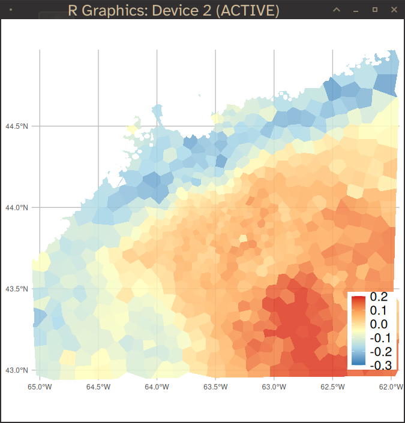
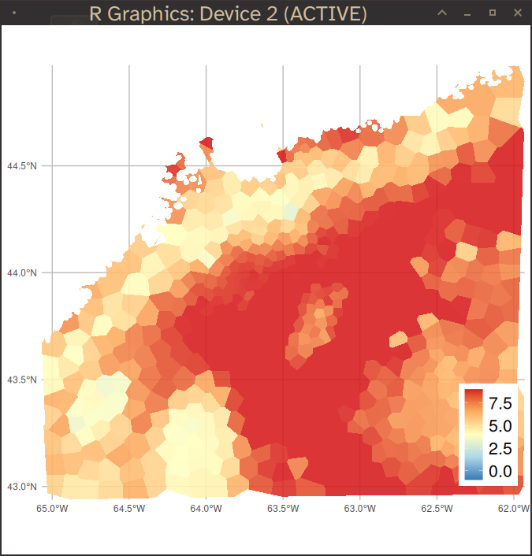

# Example: using carstm to model bottom temperatures 

## Data description

This is a small subset of real data for the area close to Halifax, Nova Scotia, Canada. 

The example data is bounded by longitudes (-65, -62) and latitudes (45, 43). It is stored as test data for carstm. We load it as follows:

```r

set.seed(12345)

require(lubridate)
fn = system.file("extdata", "aegis_spacetime_test.RDS", package="carstm" )
bottemp = readRDS( fn )   
bottemp$yr = year(bottemp$date )

# bottemp = bottemp[lon>-65 & lon< -62 & lat <45 &lat>43,]
if (0) {
    # check data
    plot(lat ~ -lon, bottemp)
    str(bottemp)

    # NOTE: t=temperature (C); z=depth (m); tiyr=decimal year

    hist( bottemp$tiyr )  # decimal date
    summary(bottemp)
}

```

---

## Analysis

To begin analysis using [CARSTM](https://github.com/jae0/carstm), we bring in the required library dependencies.

```r

# required R library list
standard_libs = c( 
    "colorspace", "lubridate",  "lattice",  "data.table", "parallel",
    "sf",  "terra", "INLA", "ggplot2", "RColorBrewer", "qs"
)
#  warning INLA has a lot of dependencies 

# fast compression in R using zstd or lz4:
# install.packages("qs", type="source" )

# aegis.* libs (found on github.com/jae0)
# at a minimum install aegis to bootstrap the others
local_libs = c(
    "aegis",   # basic data manipulations
    "aegis.coastline",  # handling coastline  
    "aegis.polygons",    # handling polygons
    "aegis.temperature",  # handing temperature data 
    "carstm"  # for computation of model
) 

# required parameter settings:
p = list()

p$libs = aegis::RLibrary ( c(standard_libs, local_libs) )

```

To the parameter list *p*, we add additional options related to areal unit configuration and modelling.  (A lot of settings ... )

```r
p$yrs = min(year(bottemp$date)):max(year(bottemp$date)) # 1980:2010
p$year.assessment = max(year(bottemp$date))

p$project_name = "test_ocean_bottom_temperatures_halifax"
p$data_root = file.path( "~", "test", p$project_name ) 
p$datadir  = file.path( p$data_root, "data" )
p$modeldir = file.path( p$data_root, "modelled" ) 

if ( !file.exists(p$data_root) ) dir.create( p$data_root, showWarnings=FALSE, recursive=TRUE )
if ( !file.exists(p$datadir) ) dir.create( p$datadir, showWarnings=FALSE, recursive=TRUE )
if ( !file.exists(p$modeldir) ) dir.create( p$modeldir, showWarnings=FALSE, recursive=TRUE )
 
p$variabletomodel = "t"
p$dimensionality="space-time-cyclic"  # output dimensions
p$quantile_bounds =c(0.005, 0.995) # trim upper bounds (in posterior predictions)
 
# space resolution
p$aegis_proj4string_planar_km = projection_proj4string("utm20")

p$dres =res 1/60/4 # resolution in angular units (degrees)
p$pres = 1  # spatial resolution in planar units (km)
p$lon0 = min( bottemp$lon )
p$lon1 = max( bottemp$lon )
p$lat0 = min( bottemp$lat )
p$lat1 = max( bottemp$lat )
p$psignif = 1  # planar sig no digits

p$nlons = trunc( diff(range(c(p$lon0,p$lon1)))/p$dres) + 1L
p$nlats = trunc( diff(range(c(p$lat0,p$lat1)))/p$dres) + 1L

corners = data.frame(lon=c(p$lon0,p$lon1), lat=c(p$lat0,p$lat1))
corners = lonlat2planar( corners, proj.type=p$aegis_proj4string_planar_km )
corners$plon = round( corners$plon, p$psignif)  # this matches the p$pres value of x km resolution
corners$plat = round( corners$plat, p$psignif)  # this matches the p$pres value of x km resolution
p$corners=corners

p$plons = seq(min(p$corners$plon), max(p$corners$plon), by=p$pres)
p$plats = seq(min(p$corners$plat), max(p$corners$plat), by=p$pres)
p$nplons = length(p$plons)
p$nplats = length(p$plats)
p$origin = c(min(p$corners$plon), min(p$corners$plat ))
p$gridparams = list( dims=c(p$nplons, p$nplats), origin=p$origin, res=c(p$pres, p$pres) ) # used for fast indexing and merging


# time resolution
p$ny = length(p$yrs)
p$nw = 10 # default value of 10 time steps number of intervals in time within a year for all temp and indicators
p$tres = 1/ p$nw # time resolution .. predictions are made with models that use seasonal components
p$dyears = (c(1:p$nw)-1) / p$nw # intervals of decimal years... fractional year breaks
p$dyear_centre = p$dyears[ trunc(p$nw/2) ] + p$tres/2
p$cyclic_levels = p$dyears + diff(p$dyears)[1]/2 

p$timezone="America/Halifax" 
p$prediction_dyear = lubridate::decimal_date( lubridate::ymd("0000/Sep/01")) # used for creating timeslices and predictions  .. needs to match the values in aegis_parameters()
p$nt = p$nw*p$ny # i.e., seasonal with p$nw (default is annual: nt=ny)

# predictions at these time values (decimal-year), # output timeslices for predictions in decimla years, yes all of them here
tout = expand.grid( yr=p$yrs, dyear=1:p$nw, KEEP.OUT.ATTRS=FALSE )
p$prediction_ts = sort( tout$yr + tout$dyear/p$nw - p$tres/2 )# mid-points


p$inputdata_spatial_discretization_planar_km = p$pres / 10 # controls resolution of data prior to modelling (km )
p$inputdata_temporal_discretization_yr = 1/52  # ie., weekly .. controls resolution of data prior to modelling to reduce data set and speed up modelling;; use 1/12 -- monthly or even 1/4.. if data density is low
p$dyear_discretization_rawdata = c( {c(1:365)-1}/365, 1)  # dyear_discretization_rawdata :: intervals of decimal years... fractional year breaks finer than the default 10 units (taking daily for now..) .. need to close right side for "cut" .. controls resolution of data prior to modelling


# areal units information
p$spatial_domain = "halifax"

p$areal_units_proj4string_planar_km =  p$aegis_proj4string_planar_km   # coord system to use for areal estimation and gridding for carstm
p$areal_units_type= "tesselation" 
p$areal_units_constraint_ntarget = floor(length(p$yrs) / 3)   # n time slices req in each au
p$areal_units_constraint_nmin = 5 # n time slices req in each au
p$areal_units_resolution_km = 1    # starting resolution .. if using tesselation/ otherwise grid size ()
p$areal_units_overlay = "none"  
p$areal_units_timeperiod = "none"   # only relevent for groundfish polys

p$tus="yr" 

p$fraction_todrop = 0.05  # fraction to drop randomly at each pass
p$fraction_cv = 1.0   # approx poisson (binomial)
p$fraction_good_bad = 0.9   # accept solution if this fraction of au's meet criteria
p$nAU_min = 30   # min total number of areal units


# carstm-specific parameters
p$project_class = "carstm"
p$carstm_model_label = "test_basic_form"
p$carstm_modelengine = "inla"   # {model engine}.{label to use to store}
 
```

## Areal units

Next we create the areal units. If desired, these can be made manually using an interactive drawing program (e.g., QGIS, GRASS, OpenStreetMap, GoogleEarth, etc.). 

```r
# create polygon  :: requires aegis, aegis.coastline, aegis.polygons
xydata = as.data.frame(bottemp[,.(lon, lat, yr) ]) 


# reduce number of areal units if you want this to go faster 
# e.g. sa_threshold_km2= 25, areal_units_constraint_nmin=20 (default above was 5)

sppoly = areal_units( p=p, xydata=xydata, 
    areal_units_directory=p$datadir,  # save loaction
    spbuffer=p$areal_units_resolution_km*2,  # length scale of hull and surrounding buffer
    n_iter_drop=3,   # no. times to try to drop nodes to meet filter requirements
    sa_threshold_km2= 4,   # min size of an areal unit
    lenprob = 0.95, # quantile of length scales to use for boundary determination (non convex hull)
    verbose=TRUE, redo=TRUE 
) 
   
plot( sppoly[ "AUID" ] ) 

if (0) {
    # map surface areas (interactive map in a web browser) using tmap 
    # tmap has a lot of dependencies, so you might not want to install it unless you already use it
    # install.packages("tmap") 
    require(tmap)
    carstm_map( sppoly=sppoly, vn="au_sa_km2", plotmethod="tmap", tmapmode="view", legend.position=c("LEFT", "top" ) )  # interactive map 
}

carstm_map( sppoly=sppoly, vn="au_sa_km2", plotmethod="ggplot", legend.position.inside=c(0.1, 0.9)  )  # default fast plot 
 
```

Which gives the following representation, based upon data density:


---

Now we can assemble the data required for modelling and identify the position of data in these areal unitss.

```r
crs_lonlat = st_crs(projection_proj4string("lonlat_wgs84"))
sppoly = areal_units( p=p, areal_units_directory=p$datadir, redo=FALSE ) 
sppoly = st_transform(sppoly, st_crs(crs_lonlat))

bottemppts = st_as_sf( bottemp[,c("lon","lat")], coords=c("lon","lat"), crs=crs_lonlat )

# observations
bottemp$tag ="observations"
bottemp$yr = year(bottemp$date)
bottemp$AUID = st_points_in_polygons(
    pts = bottemppts,
    polys = sppoly[, "AUID"],
    varname = "AUID"
)

depths = bottemp[ , .(z=median(z, na.rm=TRUE)), by=.(AUID) ]


# create prediction surface
APS = st_drop_geometry(sppoly)
setDT(APS)

APS$AUID = as.character( APS$AUID )
APS$tag ="predictions"
APS[, p$variabletomodel] = NA

APS = APS[ depths, on=.(AUID) ] 
   
n_aps = nrow(APS)
APS = cbind( APS[ rep.int(1:n_aps, p$nt), ], rep.int( p$prediction_ts, rep(n_aps, p$nt )) )
names(APS)[ncol(APS)] = "tiyr"
APS$timestamp = lubridate::date_decimal( APS$tiyr, tz=p$timezone )
APS$yr = trunc( APS$tiyr)  # year ("time*" is a keyword)
 
vvv = intersect( names(APS), names(bottemp) )
M = rbind( bottemp[, vvv, with=FALSE ], APS[, vvv, with=FALSE ] )

APS = NULL; gc()

# M$uid = 1:nrow(M)  # seems to require an iid model for each obs for stability .. use this for iid
M$AUID  = as.character(M$AUID)  # revert to factors -- should always be a character

M$space = match( M$AUID, sppoly$AUID) # require numeric index matching order of neighbourhood graph
M$space_time = M$space  # copy for space_time component (INLA does not like to re-use the same variable in a model formula) 
M$space_cyclic = M$space  # copy for space_time component (INLA does not like to 

M$year = trunc( M$tiyr)  
M$time = match( M$year, p$yrs ) # group index must be numeric/integer when used as groups 
M$time_space = M$time

M$dyear = M$tiyr - M$year 

dyri_levels = seq( 0, 1, by=0.1 )
dylev = discretize_data( p$cyclic_levels, dyri_levels )
M$dyri = discretize_data( M[["dyear"]], dyri_levels )

# do not separate out as season can be used even if not predicted upon
ii = which( M$dyear > 1) 
if (length(ii) > 0) M$dyear[ii] = 0.99 # cap it .. some surveys go into the next year
 

M$cyclic = match( M$dyri, dylev )  # easier to deal with numeric indices 
M$cyclic_space = M$cyclic # copy cyclic for space - cyclic component .. for groups, must be numeric index

if (0) {
    # save data for carstm in julia
    nb = attributes(sppoly)$nb$nbs
    obs = M[tag=="observations"]
    preds = M[tag=="predictions"]
    save( obs, nb, preds, file=file.path(p$modeldir, "example_bottom_temp.RData"), compress=TRUE)

}

# "H" in formula are created on the fly in carstm ... they can be dropped in formula or better priors defined manually

formula = as.formula( paste(
    p$variabletomodel, ' ~ 1',
    ' + f( time, model="ar1",  hyper=H$ar1 ) ',   
    ' + f( cyclic, model="rw2", scale.model=TRUE, cyclic=TRUE, values=1:10, hyper=H$rw2 ) ',
    ' + f( space, model="bym2", graph=slot(sppoly, "nb"), scale.model=TRUE, hyper=H$bym2  ) ',
    ' + f( inla.group( z, method="quantile", n=11 ), model="rw2", scale.model=TRUE, hyper=H$rw2)',
    ' + f( space_cyclic, model="bym2", graph=slot(sppoly, "nb"), scale.model=TRUE, group=cyclic_space, hyper=H$bym2, control.group=list(model="ar1", hyper=H$ar1_group, cyclic=TRUE) ) ',
    ' + f( space_time,   model="bym2", graph=slot(sppoly, "nb"), scale.model=TRUE, group=time_space,   hyper=H$bym2, control.group=list(model="ar1", hyper=H$ar1_group) ) '
) )


p$space_name = sppoly$AUID 
p$space_id = 1:nrow(sppoly)

p$time_name = as.character(p$yrs)
p$time_id =  1:p$ny

p$cyclic_name = as.character(p$cyclic_levels)
p$cyclic_id = 1:p$nw


  
# hyper parameters ("theta") from close to the final solution on INLA's internal scale:
theta = c( -0.4837, 0.7395, 0.0023, 2.0392, 2.4817, 3.7261, 0.1356, 0.5362, 10.5067, 1.6043, 0.7973, 4.6358, 0.0863  )

# takes upto 1 hr
res = carstm_model( 
    p=p, 
    data=M,
    sppoly=sppoly,
    # redo_fit=FALSE,  # force re-fit of model ?
    # debug = "posterior_samples_spatial",
    toget = c("summary", "random_spatial", "predictions"), 
    posterior_simulations_to_retain=c("predictions"), 
    nposteriors=100,  # ~ 5000 would be sufficient to sample most distributions: trade-off between file size and information content .. 100 for speed 
    # remaining args below are INLA options, passed directly to INLA
    formula=formula,
    family="gaussian",  # inla family
    theta=theta,  # start closer to solution to speed up estimation
    control.mode = list(restart=TRUE), # without this inla seems to assume theta are true hypers
    # improve.hyperparam.estimates=TRUE,
    # if problems, try other inla options: eg: 
    # control.inla = list( strategy='adaptive', int.strategy="eb" , optimise.strategy="plain", strategy='laplace', fast=FALSE),
    # control.inla = list( strategy='adaptive', int.strategy="eb" ),
    # control.inla = list( strategy='laplace' ),  # faster
    # redo_fit=FALSE,
    # debug = "predictions", 
    num.threads="4:2",  # adjust for your machine (on MSwindows, you might need "1:1") 
    verbose=TRUE 
)    


# NOTE: the above creates a number of files in the specified directory (here: ~/test/test_ocean_bottom_temperatures_halifax/modelled/test_basic_form/ )
# NOTE: these files have an extentsion of *.RDS. This is due to historical reasons. Currently they are saved as **qs** files, but still retain the RDS extension. The RDS format can still be created by choosing compress="gzip" (or bzip2, or xz -- standard RDS compression formats

# your timings will vary with OS, number of cores/threads and RAM/CPU ...
 
---------------------------------------
Run times:
Fit: 53.1 mins
Summarize results from marginals: 2.375 mins
Posterior simulations: 1.133 mins
Total: 56.61 mins
---------------------------------------

# params close to the final
# maxld= -11080.768 fn= 70 theta= -0.670 0.749 0.004 0.981 0.432 3.445 1.702 2.507 -1.454 0.454 3.474 0.064 -8.755 [7.45, 16.293]
 
 	    # theta[0] = [Log precision for the Gaussian observations]
		# theta[1] = [Log precision for time]
		# theta[2] = [Rho_intern for time]
		# theta[3] = [Log precision for cyclic]
		# theta[4] = [Log precision for space_cyclic]
		# theta[5] = [Logit phi for space_cyclic]
		# theta[6] = [Group rho_intern for space_cyclic]
		# theta[7] = [Log precision for space]
		# theta[8] = [Logit phi for space]
		# theta[9] = [Log precision for inla.group(z, method = "quantile", n = 11)]
		# theta[10] = [Log precision for space_time]
		# theta[11] = [Logit phi for space_time]
		# theta[12] = [Group rho_intern for space_time]

 

```

This provides the following as a solution (with only a simple cyclic/seasonal component):

```r
# useful if re-starting model fits ...
# modelinfo = carstm_model(  p=p, sppoly=sppoly, DS="carstm_modelinfo" )  # slow only used inside of carstm fitting

# to see results without reloading the fit as it is a large file

# parameters back transformed onto user scale
res = carstm_model(  p=p,  DS="carstm_summary" )  # parameters in p and direct summary
res$direct
Time used:
    Pre = 19, Running = 2816, Post = 42.1, Total = 2877 
Fixed effects:
             mean    sd 0.025quant 0.5quant 0.975quant  mode kld
(Intercept) 7.379 0.129      7.127    7.379      7.635 7.379   0

Random effects:
  Name	  Model
    time AR1 model
   cyclic RW2 model
   space BYM2 model
   inla.group(z, method = "quantile", n = 11) RW2 model
   space_cyclic BYM2 model
   space_time BYM2 model

Model hyperparameters:
                                                            mean       sd
Precision for the Gaussian observations                    0.617    0.007
Precision for time                                         2.109    0.557
Rho for time                                               0.023    0.077
Precision for cyclic                                       8.414    4.827
Precision for space                                      256.905 1899.225
Phi for space                                              0.780    0.285
Precision for inla.group(z, method = "quantile", n = 11)   1.217    0.686
Precision for space_cyclic                                 1.550    0.293
Phi for space_cyclic                                       0.984    0.060
GroupRho for space_cyclic                                  0.702    0.067
Precision for space_time                                   2.232    0.133
Phi for space_time                                         0.991    0.010
GroupRho for space_time                                    0.047    0.050 

Deviance Information Criterion (DIC) ...............: 67014.64
Deviance Information Criterion (DIC, saturated) ....: 21899.96
Effective number of parameters .....................: 2627.94

Watanabe-Akaike information criterion (WAIC) ...: 69082.19
Effective number of parameters .................: 3251.78

Marginal log-Likelihood:  -18012.39 

Deviance Information Criterion (DIC) ...............: 67022.21
Deviance Information Criterion (DIC, saturated) ....: 21912.19
Effective number of parameters .....................: 2631.73

Watanabe-Akaike information criterion (WAIC) ...: 69111.04
Effective number of parameters .................: 3267.47

Marginal log-Likelihood:  -18018.17 
 

res$fixed_effects
             mean     sd quant0.025 quant0.5 quant0.975          ID
(Intercept) 7.379 0.1283      7.125    7.378      7.632 (Intercept)


res$random_effects
                                                 mean       sd quant0.025
SD Gaussian observations                      1.27362 0.007547    1.25886
SD time                                       0.70293 0.066150    0.58447
SD cyclic                                     0.46503 0.065247    0.34474
SD space                                      0.29297 0.073496    0.16444
SD inla.group(z, method = "quantile", n = 11) 0.88412 0.107622    0.69891
SD space_cyclic                               0.76489 0.028283    0.71282
SD space_time                                 0.67056 0.019227    0.63355
Rho for time                                  0.01482 0.041646   -0.05911
GroupRho for space_cyclic                     0.66438 0.025900    0.61303
GroupRho for space_time                       0.04736 0.049169   -0.04814
Phi for space                                 0.98326 0.010477    0.95668
Phi for space_cyclic                          0.99310 0.007979    0.97208
Phi for space_time                            0.99141 0.008420    0.96908


```

The variance components are dominated by overall background residual errors. Space, time and depth are relatively important as well (SD ~ 1/2 of residual error). Autocorrelation in space (Phi for space) is relatively high with about 80% of the spatial variability associated with neighbourhood effects. Temporal autocorrelation is very poor both overall (Rho for time) and but high for (local, seasonal) space-cyclic!  

And finally a few plots and maps.

```r

if (0) {
    # to load saved fit
    # can be very large files .. slow 
    fit = carstm_model( p=p,  DS="modelled_fit")

    summary(fit)  # inla object
    names(fit) 
    
    plot(fit)
    plot(fit, plot.prior=TRUE, plot.hyperparameters=TRUE, plot.fixed.effects=FALSE )
 
    # posterior predictive check
    M = speciescomposition_db( p=p, DS='carstm_inputs', sppoly=sppoly  )
    carstm_posterior_predictive_check(p=p, M=M  )


    # EXAMINE POSTERIORS AND PRIORS
    all.hypers = INLA:::inla.all.hyper.postprocess(fit$all.hyper)
    hypers = fit$marginals.hyperpar
    names(hypers)

    carstm_prior_posterior_compare( hypers=hypers, all.hypers=all.hypers, i=2, xrange=c(0.02, 10) )  # note xrange is for precision .. this gets converted to SD   
    carstm_prior_posterior_compare( hypers=hypers, all.hypers=all.hypers, vn="Rho for time" )  
    carstm_prior_posterior_compare( hypers=hypers, all.hypers=all.hypers, vn="Phi for space" )  
       
    
    [1] "Precision for the Gaussian observations"                   
    [2] "Precision for time"                                        
    [3] "Rho for time"                                              
    [4] "Precision for cyclic"                                      
    [5] "Precision for space"                                       
    [6] "Phi for space"                                             
    [7] "Precision for inla.group(z, method = \"quantile\", n = 11)"
    [8] "Precision for space_cyclic"                                
    [9] "Phi for space_cyclic"                                      
    [10] "GroupRho for space_cyclic"                                 
    [11] "Precision for space_time"                                  
    [12] "Phi for space_time"                                        
    [13] "GroupRho for space_time"                                   

    # or more succinctly:
     
    res = carstm_model(  p=p, DS="carstm_summary" )  # parameters in p and summary

    names(res$hypers)
    for (i in 1:length(names(res$hypers)) ){
        o = carstm_prior_posterior_compare( hypers=res$hypers, all.hypers=res$all.hypers, vn=names(res$hypers)[i] )  
        dev.new(); print(o)
    } 

}  

fit = NULL; gc()


# annual component 
res$time$yr = as.numeric(p$time_name[res$time$ID])
plt = ggplot( res$time, aes(x=yr, y=mean)) +  geom_line(color="gray", linewidth=1.75) + geom_point( size=3, color="slategray") +
  geom_errorbar(aes(ymin=quant0.025, ymax=quant0.975), color="slategray",  linewidth=1.0, width=0.5) +
  labs(title="Annual component", x="Year", y = "Bottom temperature (deg C)") +
  theme_light( base_size=22) 
print(plt)    
# fn_plt = file.path() 
# ggsave(filename=fn_plt, plot=plt, device="svg",dpi=144, width=12, height = 8)

# seasonal component 
res$cyclic$seas = as.numeric( p$cyclic_name[res$cyclic$ID] )
plt = ggplot( res$cyclic, aes(x=seas, y=mean) ) + geom_line(color="gray", linewidth=1.75) + geom_point( size=3, color="slategray") +
  geom_errorbar(aes(ymin=quant0.025, ymax=quant0.975), color="slategray",  linewidth=1.0, width=0.05) +
  labs(title="Seasonal component", x="Year (fraction)", y = "Bottom temperature (deg C)") +
  theme_light( base_size=22) 
print(plt)    
# fn_plt = file.path() 
# ggsave(filename=fn_plt, plot=plt, device="svg",dpi=144, width=12, height = 8)

# relationship with depth
vn = "inla.group(z, method = \"quantile\", n = 11)"
plt = ggplot( res[[vn]], aes(x=ID, y=mean ))+ geom_line(color="gray", linewidth=1.75) + geom_point( size=3, color="slategray") +
  geom_errorbar(aes(ymin=quant0.025, ymax=quant0.975), color="slategray",  linewidth=1.0, width=5) +
  labs(title="Depth component", x="Depth (m)", y = "Bottom temperature (deg C)") +
  theme_light( base_size=22) 
print(plt)    
# fn_plt = file.path() 
# ggsave(filename=fn_plt, plot=plt, device="svg",dpi=144, width=12, height = 8)

# or all at once:
  oeffdir = file.path(p$modeldir, p$carstm_model_label, "figures")
    fn_root_prefix = p$
    carstm_plot_marginaleffects( p=p, outputdir=oeffdir, fn_root_prefix=fn_root_prefix ) 


# maps of some of the results
  
# persistent spatial effects "re_total" ( icar neighbourhood random effects + unstructured random effects ) 
plt = carstm_map(  
    res=carstm_model( p=p,  DS="carstm_randomeffects" ) , 
    vn=c(  "space", "re_total" ), 
    colors=rev(RColorBrewer::brewer.pal(5, "RdYlBu")),
    title="Bottom temperature spatial effects (Celsius)"
)
plt

 
```

The latter spatial effect looks like this:



Note that the light blue inshore is known as the Nova Scotia current, which runs south-west along the coastline.

Predictions can be accessed as well:
```r
 
# maps of some of the results .. this brings a webbrowser interface

res = carstm_model( p=p,  DS="carstm_predictions" )

tmatch="1990"
umatch="0.75"  # == 0.75*12 = 9 (ie. Sept)  

plt = carstm_map( 
    res = res, 
    vn=c( "predictions"), tmatch=tmatch, umatch=umatch, 
#    breaks=seq(-1, 9, by=2), 
    colors=rev(RColorBrewer::brewer.pal(5, "RdYlBu")),
    title=paste( "Bottom temperature predictions", tmatch, umatch)  
)
plt


tmatch="2010"
umatch="0.75"  # == 0.75*12 = 9 (ie. Sept)  

plt = carstm_map( 
    res=res, 
    vn=c( "predictions") , tmatch=tmatch, umatch=umatch, 
#    breaks=seq(-1, 9, by=2), 
    colors=rev(RColorBrewer::brewer.pal(5, "RdYlBu")),
    title=paste( "Bottom temperature predictions", tmatch, umatch)  
)
plt
 

# and the posterior samples to do simulations etc:
res =  carstm_model(  p=p, DS="carstm_samples" )
 
```


To remove random effects and leave the "latent signals" will require some more work but relatively straightforward to do as you have posterior samples to work with...


# finished

