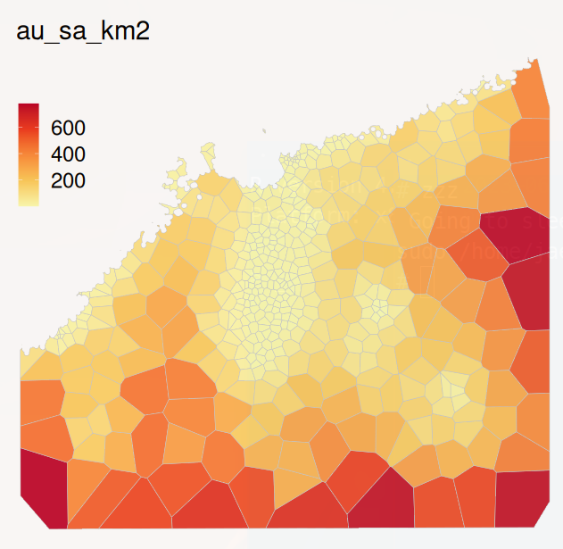
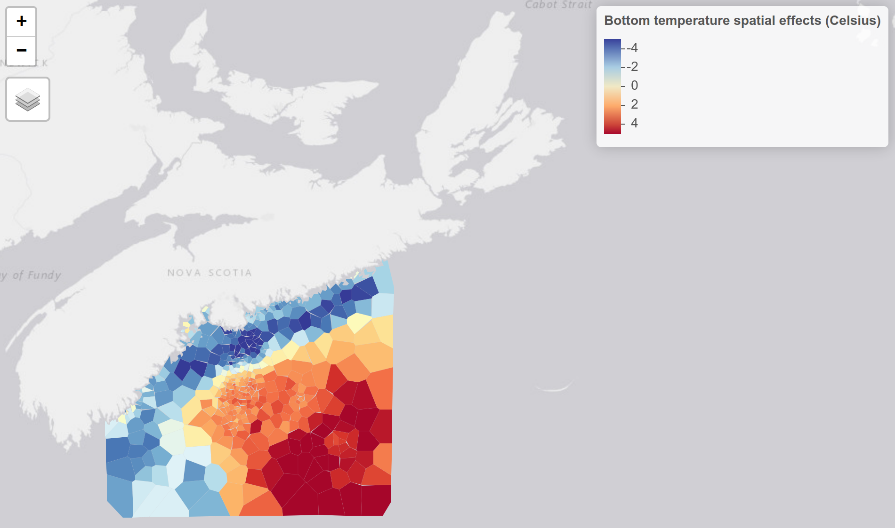
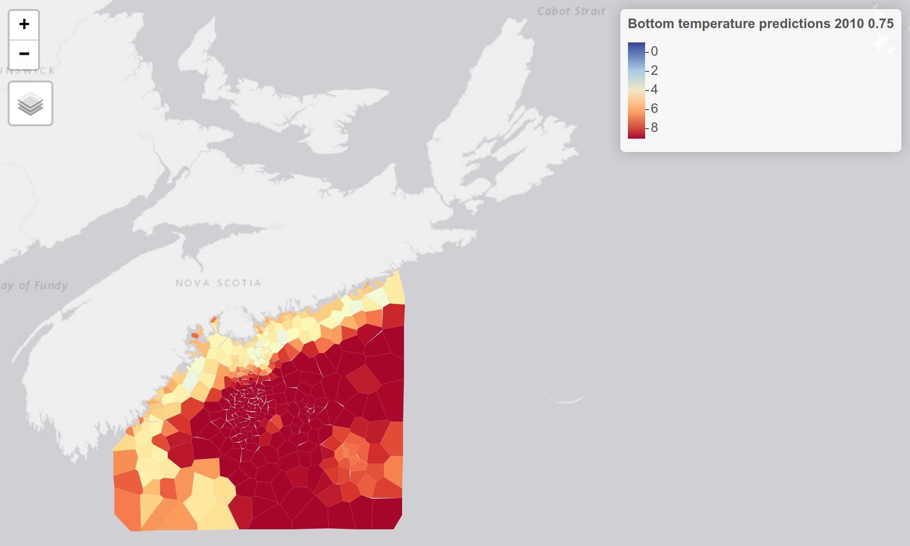

# Example: using carstm to model bottom temperatures 

## Data description

This is a small subset of real data for the area close to Halifax, Nova Scotia, Canada. 

The example data is bounded by longitudes (-65, -62) and lattitdes (45, 43). It is stored as test data for carstm. We load it as follows:

```r

set.seed(12345)
 
bottemp = readRDS( system.file("extdata", "aegis_spacetime_test.RDS", package="carstm" ) )   
bottemp$yr = year(bottemp$date )

# bottemp = bottemp[lon>-65 & lon< -62 & lat <45 &lat>43,]
if (0) {
    # check data
    plot(lat ~ -lon, bottemp)
    str(bottemp)

    # NOTE: t=temperature (C); z=depth (m); tiyr=decimal year

    hist( bottemp$tiyr )  # decimal date
    summary(bottemp)
}
```

---

## Analysis

To begin analysis using [CARSTM](https://github.com/jae0/carstm), we bring in the required library dependencies.

```r

# required R library list
standard_libs = c( "colorspace", "lubridate",  "lattice",  "parallel", "sf", "GADMTools", "INLA" , "data.table", "ggplot2", "RColorBrewer" )

# aegis.* libs (found on github.com/jae0)
local_libs = c(
    "aegis",   # basic data manipulations
    "aegis.coastline",  # handling coastline  
    "aegis.polygons",    # handling polygons
    "aegis.temperature",  # handing temperature data 
    "carstm"  # for computation of model
) 

# required parameter settings:
p = list()

p$libs = RLibrary ( c(standard_libs, local_libs) )
```

To the parameter list *p*, we add additional options related to areal unit configuration and modelling.

```r
p$yrs = min(year(bottemp$date)):max(year(bottemp$date)) # 1980:2010
p$year.assessment = max(year(bottemp$date))

p$project_name = "test_ocean_bottom_temperatures_halifax"
p$data_root = file.path( "~", "test", p$project_name ) 
p$datadir  = file.path( p$data_root, "data" )
p$modeldir = file.path( p$data_root, "modelled" ) 

if ( !file.exists(p$data_root) ) dir.create( p$data_root, showWarnings=FALSE, recursive=TRUE )
if ( !file.exists(p$datadir) ) dir.create( p$datadir, showWarnings=FALSE, recursive=TRUE )
if ( !file.exists(p$modeldir) ) dir.create( p$modeldir, showWarnings=FALSE, recursive=TRUE )
 
p$variabletomodel = "t"
p$dimensionality="space-time-cyclic"  # output dimensions
p$quantile_bounds =c(0.005, 0.995) # trim upper bounds (in posterior predictions)
 
# space resolution
p$aegis_proj4string_planar_km = projection_proj4string("utm20")

p$dres = 1/60/4 # resolution in angular units (degrees)
p$pres = 1  # spatial resolution in planar units (km)
p$lon0 = min( bottemp$lon )
p$lon1 = max( bottemp$lon )
p$lat0 = min( bottemp$lat )
p$lat1 = max( bottemp$lat )
p$psignif = 1  # planar sig no digits

p$nlons = trunc( diff(range(c(p$lon0,p$lon1)))/p$dres) + 1L
p$nlats = trunc( diff(range(c(p$lat0,p$lat1)))/p$dres) + 1L

corners = data.frame(lon=c(p$lon0,p$lon1), lat=c(p$lat0,p$lat1))
corners = lonlat2planar( corners, proj.type=p$aegis_proj4string_planar_km )
corners$plon = round( corners$plon, p$psignif)  # this matches the p$pres value of x km resolution
corners$plat = round( corners$plat, p$psignif)  # this matches the p$pres value of x km resolution
p$corners=corners

p$plons = seq(min(p$corners$plon), max(p$corners$plon), by=p$pres)
p$plats = seq(min(p$corners$plat), max(p$corners$plat), by=p$pres)
p$nplons = length(p$plons)
p$nplats = length(p$plats)
p$origin = c(min(p$corners$plon), min(p$corners$plat ))
p$gridparams = list( dims=c(p$nplons, p$nplats), origin=p$origin, res=c(p$pres, p$pres) ) # used for fast indexing and merging


# time resolution
p$ny = length(p$yrs)
p$nw = 10 # default value of 10 time steps number of intervals in time within a year for all temp and indicators
p$tres = 1/ p$nw # time resolution .. predictions are made with models that use seasonal components
p$dyears = (c(1:p$nw)-1) / p$nw # intervals of decimal years... fractional year breaks
p$dyear_centre = p$dyears[ trunc(p$nw/2) ] + p$tres/2
p$cyclic_levels = p$dyears + diff(p$dyears)[1]/2 

p$timezone="America/Halifax" 
p$prediction_dyear = lubridate::decimal_date( lubridate::ymd("0000/Sep/01")) # used for creating timeslices and predictions  .. needs to match the values in aegis_parameters()
p$nt = p$nw*p$ny # i.e., seasonal with p$nw (default is annual: nt=ny)

# predictions at these time values (decimal-year), # output timeslices for predictions in decimla years, yes all of them here
tout = expand.grid( yr=p$yrs, dyear=1:p$nw, KEEP.OUT.ATTRS=FALSE )
p$prediction_ts = sort( tout$yr + tout$dyear/p$nw - p$tres/2 )# mid-points


p$inputdata_spatial_discretization_planar_km = p$pres / 10 # controls resolution of data prior to modelling (km )
p$inputdata_temporal_discretization_yr = 1/52  # ie., weekly .. controls resolution of data prior to modelling to reduce data set and speed up modelling;; use 1/12 -- monthly or even 1/4.. if data density is low
p$dyear_discretization_rawdata = c( {c(1:365)-1}/365, 1)  # dyear_discretization_rawdata :: intervals of decimal years... fractional year breaks finer than the default 10 units (taking daily for now..) .. need to close right side for "cut" .. controls resolution of data prior to modelling


# areal units information
p$spatial_domain = "halifax"

p$areal_units_proj4string_planar_km =  p$aegis_proj4string_planar_km   # coord system to use for areal estimation and gridding for carstm
p$areal_units_type= "tesselation" 
p$areal_units_constraint_ntarget = length(p$yrs)   # n time slices req in each au
p$areal_units_constraint_nmin = 5 # n time slices req in each au
p$areal_units_resolution_km = 3    # starting resolution .. if using tesselation/ otherwise grid size ()
p$areal_units_overlay = "none"  
p$areal_units_timeperiod = "none"   # only relevent for groundfish polys

p$tus="yr" 

p$fraction_todrop = 0.025
p$fraction_cv = 0.9   # approx poisson (binomial)
p$fraction_good_bad = 0.9 
p$nAU_min = 100   # min total number of areal units


# carstm-specific parameters
p$project_class = "carstm"
p$carstm_model_label = "test_basic_form"
p$carstm_modelengine = "inla"   # {model engine}.{label to use to store}
 
```

## Areal units

Next we create the areal units. If desired, these can be made manually using an interactive drawing program (e.g., QGIS, GRASS, OpenStreetMap, GoogleEarth, etc.). 

```r
# create polygon  :: requires aegis, aegis.coastline, aegis.polygons
xydata = as.data.frame(bottemp[,.(lon, lat, yr) ]) 

sppoly = areal_units( p=p, xydata=xydata, areal_units_directory=p$datadir, spbuffer=10, n_iter_drop=3, sa_threshold_km2=9, verbose=TRUE, redo=TRUE ) 
    
# sppoly = try( areal_units( p=p, areal_units_directory=p$datadir, redo=FALSE ) )

plot( sppoly[ "AUID" ] ) 

# map surface areas 
carstm_map( sppoly=sppoly, vn="au_sa_km2", plotmethod="tmap", tmapmode="view", legend.position=c("LEFT", "top" ) )  # interactive map 

carstm_map( sppoly=sppoly, vn="au_sa_km2", plotmethod="ggplot", legend.position=c(0.1, 0.9)  )  # default fast plot 
 
```

Which gives the following representation, based upon data density:



---

Now we can assemble the data required for modelling and identify the position of data in these areal unitss.

```r
crs_lonlat = st_crs(projection_proj4string("lonlat_wgs84"))
sppoly = st_transform(sppoly, st_crs(crs_lonlat))

bottemppts = st_as_sf( bottemp[,c("lon","lat")], coords=c("lon","lat"), crs=crs_lonlat )

# observations
bottemp$tag ="observations"
bottemp$yr = year(bottemp$date)
bottemp$AUID = st_points_in_polygons(
    pts = bottemppts,
    polys = sppoly[, "AUID"],
    varname = "AUID"
)

depths = bottemp[ , .(z=median(z, na.rm=TRUE)), by=.(AUID) ]


# create prediction surface
APS = st_drop_geometry(sppoly)
setDT(APS)

APS$AUID = as.character( APS$AUID )
APS$tag ="predictions"
APS[, p$variabletomodel] = NA

APS = APS[ depths, on=.(AUID) ] 
   
n_aps = nrow(APS)
APS = cbind( APS[ rep.int(1:n_aps, p$nt), ], rep.int( p$prediction_ts, rep(n_aps, p$nt )) )
names(APS)[ncol(APS)] = "tiyr"
APS$timestamp = lubridate::date_decimal( APS$tiyr, tz=p$timezone )
APS$yr = trunc( APS$tiyr)  # year ("time*" is a keyword)
 
vvv = intersect( names(APS), names(bottemp) )
M = rbind( bottemp[, vvv, with=FALSE ], APS[, vvv, with=FALSE ] )

APS = NULL; gc()

# M$uid = 1:nrow(M)  # seems to require an iid model for each obs for stability .. use this for iid
M$AUID  = as.character(M$AUID)  # revert to factors -- should always be a character

M$space = match( M$AUID, sppoly$AUID) # require numeric index matching order of neighbourhood graph
M$space_time = M$space  # copy for space_time component (INLA does not like to re-use the same variable in a model formula) 
M$space_cyclic = M$space  # copy for space_time component (INLA does not like to 

M$year = trunc( M$tiyr)  
M$time = match( M$year, p$yrs ) # group index must be numeric/integer when used as groups 
M$time_space = M$time

M$dyear = M$tiyr - M$year 

dyri_levels = seq( 0, 1, by=0.1 )
dylev = discretize_data( p$cyclic_levels, dyri_levels )
M$dyri = discretize_data( M[["dyear"]], dyri_levels )

# do not separate out as season can be used even if not predicted upon
ii = which( M$dyear > 1) 
if (length(ii) > 0) M$dyear[ii] = 0.99 # cap it .. some surveys go into the next year
 

M$cyclic = match( M$dyri, dylev )  # easier to deal with numeric indices 
M$cyclic_space = M$cyclic # copy cyclic for space - cyclic component .. for groups, must be numeric index
 
# "H" in formula are created on the fly in carstm ... they can be dropped in formula or better priors defined manually

formula = as.formula( paste(
    p$variabletomodel, ' ~ 1',
    ' + f( time, model="ar1",  hyper=H$ar1 ) ',   
    ' + f( cyclic, model="rw2", scale.model=TRUE, cyclic=TRUE, values=1:10, hyper=H$rw2 ) ',
    ' + f( space_cyclic, model="bym2", graph=slot(sppoly, "nb"), scale.model=TRUE, group=cyclic_space, hyper=H$bym2, control.group=list(model="ar1", hyper=H$ar1_group, cyclic=TRUE) ) ',
    ' + f( space, model="bym2", graph=slot(sppoly, "nb"), scale.model=TRUE, hyper=H$bym2  ) ',
    ' + f( inla.group( z, method="quantile", n=11 ), model="rw2", scale.model=TRUE, hyper=H$rw2)',
    ' + f( space_time, model="bym2", graph=slot(sppoly, "nb"), scale.model=TRUE, group=time_space, hyper=H$bym2, control.group=list(model="ar1", hyper=H$ar1_group) ) '
) )


p$space_name = sppoly$AUID 
p$space_id = 1:nrow(sppoly)
p$time_id =  1:p$ny
p$cyclic_id = 1:p$nw


# takes about 15 minutes
res = carstm_model( 
    p=p, 
    data=M,
    sppoly=sppoly,
    posterior_simulations_to_retain=c("predictions", "random_spatial"), 
    nposteriors=100,  # 1000 to 5000 would be sufficient to sample most distributions: trade-off between file size and information content
    # remaining args below are INLA options, passed directly to INLA
    formula=formula,
    family="gaussian",  # inla family
    theta=c( -0.670, 0.749, 0.004, 0.981, 0.432, 3.445, 1.702, 2.507, -1.454, 0.454, 3.474, 0.064, -8.755 ),  # start closer to solution to speed up  
    num.threads="2:1",  # adjust for your machine
    # if problems, try any of: 
    # control.inla = list( strategy='adaptive', int.strategy="eb" , optimise.strategy="plain", strategy='laplace', fast=FALSE),
    # control.inla = list( strategy='adaptive', int.strategy="eb" ),
    # control.inla = list( strategy='laplace' ),  # faster
    # redo_fit=FALSE,
    # debug = "predictions", 
    verbose=TRUE 
)    

# params close to the final
# maxld= -11080.768 fn= 70 theta= -0.670 0.749 0.004 0.981 0.432 3.445 1.702 2.507 -1.454 0.454 3.474 0.064 -8.755 [7.45, 16.293]
 
 	    # theta[0] = [Log precision for the Gaussian observations]
		# theta[1] = [Log precision for time]
		# theta[2] = [Rho_intern for time]
		# theta[3] = [Log precision for cyclic]
		# theta[4] = [Log precision for space_cyclic]
		# theta[5] = [Logit phi for space_cyclic]
		# theta[6] = [Group rho_intern for space_cyclic]
		# theta[7] = [Log precision for space]
		# theta[8] = [Logit phi for space]
		# theta[9] = [Log precision for inla.group(z, method = "quantile", n = 11)]
		# theta[10] = [Log precision for space_time]
		# theta[11] = [Logit phi for space_time]
		# theta[12] = [Group rho_intern for space_time]


(res$summary)

```

This provides the following as a solution (with only a simple cyclic/seasonal component):

```r
Deviance Information Criterion (DIC) ...............: 73073.06
Deviance Information Criterion (DIC, saturated) ....: 19974.04
Effective number of parameters .....................: 556.18

Watanabe-Akaike information criterion (WAIC) ...: 73045.28
Effective number of parameters .................: 525.95

Marginal log-Likelihood:  -28206.58 
 is computed 

$fixed_effects
             mean    sd quant0.025 quant0.5 quant0.975          ID
(Intercept) 6.945 1.917      3.117    6.942      10.77 (Intercept)

$random_effects
                                                  mean        sd quant0.025
SD Gaussian observations                       1.56343 8.129e-03    1.54708
SD time                                        0.67932 1.061e-01    0.47326
SD cyclic                                      0.27732 2.072e-01    0.09053
SD space                                       0.71235 3.058e-02    0.65377
SD inla.group(z, method = "quantile", n = 11)  0.89586 2.362e-01    0.48495
SD space_time                                  0.22435 2.039e-02    0.18339
Rho for time                                   0.04661 1.683e-01   -0.28778
GroupRho for space_time                       -0.99999 3.855e-05   -1.00000
Phi for space                                  0.80607 3.836e-02    0.71885
Phi for space_time                             0.31895 1.739e-01    0.04290

```

The variance components are dominated by overall background residual errors. Space, time and depth are relatively important as well (SD ~ 1/2 of residual error). Autocorrelation in space (Phi for space) is relatively high with about 80% of the spatial variability associated with neighbourhood effects. Temporal autocorrelation is very poor both overall (Rho for time) and in fact for space-time, actually -1! Suggesting extremely high temporal variability that the 10 units of seasonal increments absorbs the autocorrelation reasonably well, leaving variations that are operating on other temporal scales (periodicities).  

And finally a few plots and maps.

```r

# to load saved fit
# can be very large files .. slow 
fit = carstm_model( p=p, sppoly=sppoly, DS="carstm_modelled_fit")

summary(fit)
names(fit)
fit$summary$dic$dic
fit$summary$dic$p.eff

plot(fit)
plot(fit, plot.prior=TRUE, plot.hyperparameters=TRUE, plot.fixed.effects=FALSE )


# to reload saved results summary
# res = carstm_model( p=p, sppoly=sppoly, DS="carstm_modelled_summary")
 
ts =  res$random$time 
plot( mean ~ ID, ts, type="b", ylim=c(-2,2), lwd=1.5, xlab="year")
lines( quant0.025 ~ ID, ts, col="gray", lty="dashed")
lines( quant0.975 ~ ID, ts, col="gray", lty="dashed")


ts =  res$random$cyclic
plot( mean ~ID, ts, type="b", ylim=c(-5, 5), lwd=1.5, xlab="fractional year")
lines( quant0.025 ~ID, ts, col="gray", lty="dashed")
lines( quant0.975 ~ID, ts, col="gray", lty="dashed")


# and some maps:
map_centre = c( (p$lon0+p$lon1)/2 - 0.5, (p$lat0+p$lat1)/2   )
map_zoom = 7
 
# persistent spatial effects
plt = carstm_map(  res=res, vn=c( "random", "space", "combined" ), 
    sppoly=sppoly,
    breaks=seq(-5, 5, by=2), 
    palette="-RdYlBu",
    plot_elements=c( "isobaths",  "compass", "scale_bar", "legend" ),
    # tmap_zoom= c(map_centre, map_zoom),
    title="Bottom temperature spatial effects (Celsius)"
)
plt

```

The latter spatial effect looks like this:




Predictions can be accessed as well:
```r
map_centre = c( (p$lon0+p$lon1)/2 - 0.5, (p$lat0+p$lat1)/2   )
map_zoom = 7

# maps of some of the results .. this brings a webbrowser interface
tmatch="2010"
umatch="0.75"  # == 0.75*12 = 9 (ie. Sept)  

plt = carstm_map(  res=res, vn="predictions", tmatch=tmatch, umatch=umatch, 
    sppoly=sppoly,
    breaks=seq(-1, 9, by=2), 
    palette="-RdYlBu",
    plot_elements=c( "isobaths",  "compass", "scale_bar", "legend" ),
    tmap_zoom= c(map_centre, map_zoom),
    title=paste( "Bottom temperature predictions", tmatch, umatch)  
)
plt

```


To remove random effects and leave the "latent signals" will require some more work but relatively straightforward to do as you have posterior samples to work with...

# finished

